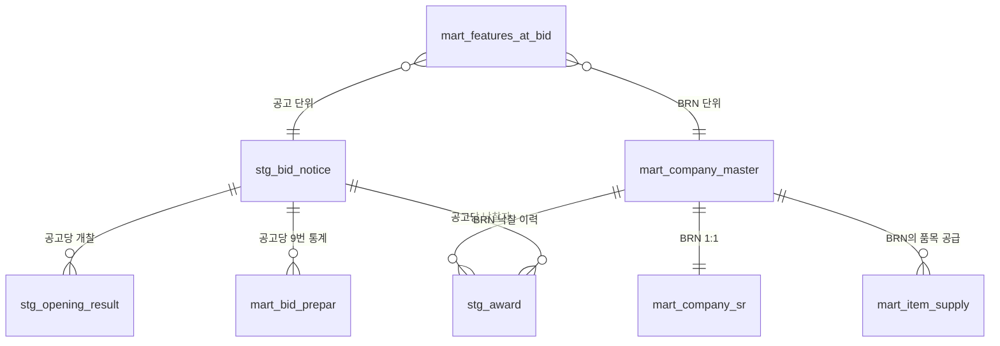

# ECO 추천 시스템 — 팀원 온보딩

> 환경공단 발주 담당 공무원이 **공고 발주 전** 품목·정책·예산 입력 → 후보 BRN top-K 추천하는 의사결정 지원 도구.

---

## 0. 빠른 시작 (10분)

```bash
# 1. 코드
git clone <REPO_URL> eco && cd eco

# 2. Python 환경 (uv)
curl -LsSf https://astral.sh/uv/install.sh | sh   # uv 미설치 시
uv sync                                            # .venv 자동 생성

# 3. PostgreSQL 복원
createdb eco
pg_restore --no-owner -d eco eco_dump_2026_05_06.dump   # dump 파일 별도 공유

# 4. 환경변수
cp .env.example .env
# .env 편집: G2B_SERVICE_KEY=<공공데이터포털 발급키>

# 5. 동작 확인
uv run python -c "from pipeline.recommend_v2 import recommend, RecommendV2Request; \
  print(recommend(RecommendV2Request(item_keyword='하수처리용 펌프', \
        budget_million_won=800, sr_filter={'social_corp':False,'female_ceo':False,'disabled_corp':False}, top_k=3)))"

# 6. 백엔드 + 프론트
uv run uvicorn api.main:app --reload --port 8000   # 터미널 1
cd frontend && npm install && npm run dev          # 터미널 2 (5173)
```

---

## 1. 시스템 한 그림

```
[조달청 G2B OpenAPI 4종]              [조달업체 CSV]
        │                                    │
        ▼ ingest                              ▼
[raw_g2b_*]  bronze                   [mart_company_master/sr]
        │                                    │
        ▼ build_stg                          │
[stg_*]  silver  (정제·정규화)        [mart_item_supply]
        │                                    │
        └────────┬───────────────────────────┘
                 ▼ build_features
        [mart_features_at_bid]  gold  (LGBM 학습용 PIT 피처)
                 │
                 ▼ pipeline.recommend_v2.recommend()
        [Stage 1 Retrieve] → [Stage 2 Rank] → [Enrich]
                 │                                
                 ▼ /api/v2/recommend
        [React 대시보드]
```

---

## 2. 데이터 모델 — 계층

### Bronze (raw) — G2B API 원본 그대로
| 테이블 | 출처 | PK |
|---|---|---|
| `raw_g2b_bid_notice` | 14번 입찰공고 | (fetched_at, bid_ntce_no, bid_ntce_ord) |
| `raw_g2b_award` | 1번 낙찰자 | (bid_ntce_no, bid_ntce_ord, bid_clsfc_no, rbid_no) |
| `raw_g2b_opening` | 5번 개찰결과 | 동일 |
| `raw_g2b_prepar` | 9번 복수예가 | (bid_ntce_no, bid_ntce_ord, bid_clsfc_no, rbid_no, sno) |

### Silver (stg) — 정제·정규화
| 테이블 | 핵심 컬럼 |
|---|---|
| `stg_bid_notice` | bid_ntce_no, dminstt_cd, **agency_tier** (env_corp/env_domain/other), dtil_prdct_clsfc_no, bid_ntce_dt |
| `stg_award` | bidwinnr_brn (낙찰자 BRN), sucsfbid_amt (낙찰액), sucsfbid_rate (낙찰률) |
| `stg_opening_result` | winner_brn (1순위), prtcpt_cnum |
| `stg_prepar_price` | 9번 정제 |

### Gold (mart) — 집계·조인 완료
| 테이블 | PK | 용도 |
|---|---|---|
| `mart_company_master` | brn | 업체 마스터 (이름/규모/권역/G2B 등록일) |
| `mart_company_sr` | brn | SR 인증 (여성/장애인/사회적/sr_count) |
| `mart_item_supply` | (dtil_prdct_clsfc_no, brn) | BRN×품목 공급 매트릭스 |
| `mart_bid_prepar` | (bid_ntce_no, bid_ntce_ord) | 9번 통계 집계 (15행→1행) |
| `mart_features_at_bid` | (bid_ntce_no, bid_ntce_ord, brn) | **LGBM 학습용 30 PIT 피처** |

---

## 3. ER 관계 (간략)



**조인 키:**
- `BRN` (사업자등록번호 10자리) — 모든 BRN 데이터의 통합 키. 정규화 필수 (`pipeline.g2b_common.normalize_brn`)
- `bid_ntce_no` (공고번호 13자리) + `bid_ntce_ord` (차수) — 공고 단위 PK
- `dtil_prdct_clsfc_no` (세부품명번호 10자리) — 품목 분류

---

## 4. 피처 엔지니어링 — `mart_features_at_bid` 30 컬럼

### 키 (PK + 라벨)
| 컬럼 | 타입 | 설명 |
|---|---|---|
| bid_ntce_no, bid_ntce_ord, brn | str | (공고 × BRN) PK |
| **is_winner** | bool | **타겟** — 이 BRN이 이 공고에서 최종 낙찰 |
| participated_in_bid | bool | 응찰 여부 (1순위 또는 낙찰자) |

### A. BRN 정적 (7)
| 컬럼 | 의미 |
|---|---|
| corp_size | 중소/중견/대기업 |
| is_manufacturer | 제조업 자체생산 여부 |
| region_code | 시도 코드 (2자리) |
| g2b_age_years | G2B 등록 연수 |
| female_ceo_flag, disabled_corp_flag, social_corp_flag | SR 인증 |
| real_sr_flag | 실질SR (장애인 OR 사회적) |

### B. BRN 환경공단 누적 PIT (5)
PIT = Point-In-Time. 각 공고의 `cutoff_date` (= 공고 게시일) 이전 데이터만 집계 → leakage 방지.

| 컬럼 | 의미 |
|---|---|
| env_award_count_pit | 환경공단 누적 낙찰 건수 |
| env_award_amt_pit | 누적 낙찰액 |
| env_avg_rate_pit | 평균 낙찰률 |
| env_dminstt_count_pit | 거래한 환경공단 dminstt 수 (다양성) |
| env_recent_1y_count_pit | 최근 1년 낙찰 건수 |
| days_since_last_award_pit | 마지막 낙찰 후 경과일 |

### C. BRN 응찰 패턴 PIT (4) — 1순위 vs 최종 낙찰 차이 신호
1순위인데 최종 낙찰 못 받으면 (자격 검사 탈락 / 시담 결렬) 위험 신호.

| 컬럼 | 의미 |
|---|---|
| bid_top1_count_pit | 1순위 누적 횟수 |
| bid_lost_count_pit | 1순위였으나 최종낙찰 실패 횟수 |
| bid_lost_ratio_pit | lost / top1 |
| bid_recent_lost_count_pit | 최근 1년 탈락 |

### D. BRN × 품목 매칭 PIT (3)
| 컬럼 | 의미 |
|---|---|
| brn_item_award_count_pit | 같은 prefix4 누적 낙찰 |
| brn_item_avg_rate_pit | 같은 prefix4 평균 낙찰률 |
| main_prdct_match | BRN의 main_dtil_prdct == 공고 품목 |

### E. BRN × 권역 PIT (1)
| 컬럼 | 의미 |
|---|---|
| brn_dminstt_award_count_pit | 그 발주청 직접 거래 누적 |

### F. 공고 측 (5)
| 컬럼 | 의미 |
|---|---|
| presmpt_prce | 사정가격 |
| asign_bdgt_amt | 배정예산 |
| cntrct_cncls_mthd_nm | 계약방식 (일반경쟁/제한/수의) |
| bid_month, bid_quarter | 시기 (계절성) |
| bid_dminstt_cd | 발주청 코드 |
| bid_dtil_prdct_no | 품목 분류번호 |

### G. 시장 구조 PIT (3)
| 컬럼 | 의미 |
|---|---|
| item_pool_density_pit | 그 품목 등록 BRN 수 (시장 깊이) |
| item_recent_unmet_pit | 최근 미낙찰 비율 |
| item_top1_concentration_pit | 상위 BRN 집중도 |

### 메타
| 컬럼 | 의미 |
|---|---|
| cutoff_date | PIT 기준 시점 (이 시점 이전 데이터만 사용) |
| last_synced_at | 빌드 시점 |

**중요**: 모든 `*_pit` 컬럼은 `cutoff_date` 이전 데이터만 사용. 빌드 SQL은 `pipeline/build_features.py` 또는 `sql/2026-05-05_features.sql`.

---

## 5. 추천 워크플로우 (v2 운영 모드)

```
사용자 입력 (RecommendV2Request)
   │ {item_keyword, budget_million_won, sr_filter, top_k}
   ▼
[Stage 1] retrieve  (pipeline/recommend_v2.retrieve)
   ├─ 키워드 → KEYWORD_FILTERS dict (11개) → (prefix4_list, name_regex)
   ├─ candidate_brns CTE
   │  ├─ (a) mart_item_supply ∩ warm_brns (등록 BRN)
   │  └─ (b) UNION 실제 매칭 prefix4+regex 낙찰 BRN (등록 미반영 보완)
   └─ sr_filter hard AND filter
   ▼
[Stage 2] rank  (pipeline/ranker.RuleRanker)
   ├─ 4축 가중합 (sr 0.35 + track 0.30 + price 0.20 + supply 0.15)
   ├─ SR soft floor: n_sr_certified ≥ 3 → sr=0 BRN -1.0 demote
   └─ ★ swap point: ranker=LGBMRanker() 한 줄 교체
   ▼
[Enrich] (top_k 만)
   ├─ 시장 baseline (전체 + 유사 규모)
   ├─ BRN 낙찰률 분포 (전체 + 유사 규모) ← 외삽 방지
   ├─ 1순위 탈락 이력
   ├─ 최근 낙찰 5건
   ├─ 유사 발주 사례
   └─ 시각화 raw
   ▼
[KPI + Compliance + 정렬]
   ▼
RecommendV2Response → 프론트
```

---

## 6. 코드 진입점 — 어디부터 보면 좋나

| 목적 | 파일 |
|---|---|
| 시스템 전체 이해 | `CLAUDE.md` (특히 §11 §12 §13) |
| 추천 로직 (메인) | `pipeline/recommend_v2.py` |
| 룰베이스 점수 (Stage 2) | `pipeline/ranker.py` (Ranker Protocol + RuleRanker) |
| 키워드 매핑 | `pipeline/item_keywords.py` |
| API 엔드포인트 | `api/main.py` |
| 응답 스키마 | `api/schemas.py` |
| 정책 상수 (SR floor 등) | `pipeline/policy.py` |
| 수집 (이미 동작) | `scripts/ingest_*.py`, `pipeline/g2b_*.py` |
| 마트 빌드 | `scripts/build_stg.py`, `scripts/build_features.py` |
| 학습 (참고용) | `scripts/train_baseline.py` (LGBM Classifier) |
| 테스트 (27개) | `tests/test_recommend_v2_pure.py` |
| 프론트 메인 | `frontend/src/App.tsx` |
| 디자인 목업 | `analysis/dashboard_mockup_v2_1.html` |

---

## 7. 데이터 dump / restore

### Dump (운영자 측)
```bash
pg_dump eco -F c -f eco_dump_$(date +%Y_%m_%d).dump
# 산출 파일 약 ~50MB. Drive/USB 공유.
```

### Restore (팀원 측)
```bash
createdb eco
pg_restore --no-owner -d eco eco_dump_2026_05_06.dump
psql eco -c "SELECT COUNT(*) FROM mart_company_master;"  # 검증
```

### G2B 신규 적재 (선택 — 본인 키 보유 시)
```bash
# 14번 → 1번 → 5번 → 9번 → build_stg → build_features 순
uv run python scripts/ingest_bid_notice.py --start 2025-05-01 --end 2026-05-01
uv run python scripts/ingest_award.py --skip-empty
uv run python scripts/ingest_opening.py --skip-empty
uv run python scripts/ingest_prepar.py --skip-empty
uv run python scripts/build_stg.py
uv run python scripts/build_features.py
```

---

## 8. FAQ

**Q. 왜 LGBM 학습은 했는데 운영엔 안 쓰나?**
A. CLAUDE.md §13 참조. 사전탐색 모드 (공고 부재) 와 LGBM 학습 입력 (공고 + BRN) 미스매치. 향후 synthetic bid 또는 회귀 모델로 swap 예정.

**Q. agency_tier 가 뭐?**
A. `env_corp` (한국환경공단 10), `env_domain` (수자원공사+상수도+환경부 26), `other` (그 외). 풀 확장용. `pipeline.g2b_common.agency_tier_for()` 매핑.

**Q. PIT 가 뭐?**
A. Point-In-Time. 각 공고 시점 이전 데이터만 집계 → 미래 정보 누설(leakage) 방지. mart_features_at_bid 의 모든 `*_pit` 컬럼이 cutoff_date 이전 한정.

**Q. 새 키워드 추가하려면?**
A. `pipeline/item_keywords.py` `KEYWORD_FILTERS` dict 에 `(prefix4_list, name_regex)` 추가. 백엔드 자동 노출. 프론트 칩도 자동 (useKeywords 훅).

**Q. 가중치 (4축) 변경?**
A. `pipeline/ranker.py` `DEFAULT_WEIGHTS`. 단, sr_diversity ≥ 0.20 (사회적가치법 하한, `pipeline/policy.py`).

**Q. 외삽 경고는 언제?**
A. BRN 의 입력 예산 ±50% 범위 거래 부재. ExpectedPrice.is_extrapolated=True. 카드에 빨간 배지.

**Q. 의무비율 20% 어디서 옴?**
A. 조달사업법 시행령 제24조 "사회적가치 우선구매". `pipeline/policy.SR_LEGAL_FLOOR_PCT = 20.0` 단일 정의.

---

## 9. 개발 명령

```bash
# 테스트
uv run python -m unittest tests.test_recommend_v2_pure -v   # 27개

# 린트
uvx ruff check pipeline/ api/ tests/

# 백엔드 + 프론트 띄우기
uv run uvicorn api.main:app --reload --port 8000
cd frontend && npm run dev

# curl 테스트
curl -X POST http://localhost:8000/api/v2/recommend -H 'Content-Type: application/json' \
  -d '{"item_keyword":"하수처리용 펌프","budget_million_won":800,"sr_filter":{"social_corp":false,"female_ceo":false,"disabled_corp":false},"top_k":3}'
```

---

## 10. 주의사항 (CLAUDE.md §9)

- **G2B_SERVICE_KEY** 는 `.env` 만 — git commit 금지
- **새 라이브러리 임의 추가 금지** — 사용자 확인 필수
- **PostgreSQL 스키마 변경 시** `sql/<날짜>_<설명>.sql` 마이그레이션 파일 필수
- **8 키워드 외 자연어 free-text 매핑 금지** — `KEYWORD_FILTERS` dict 만
- **calibration 안 된 ML 점수 raw 노출 금지** — 운영 카드는 등급(A/B/C) 또는 순위만
- **공무원 사용자에게 ingest 트리거 권한 X** — 운영팀 책임

---

문제 / 추가 질문은 PR 또는 운영팀에 문의.
